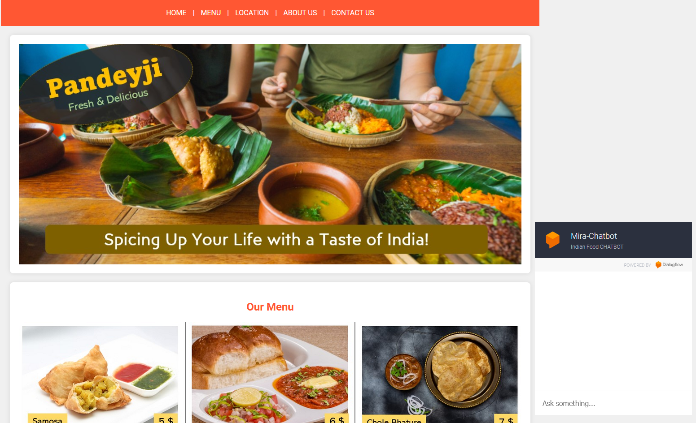

# Food Delivery Chatbot

Welcome to the Food Delivery Chatbot project! This project is designed to facilitate food ordering via a conversational chatbot interface. Utilizing Natural Language Processing (NLP), this chatbot can understand and process user requests, manage orders, and provide live updates.

## Overview
This Food Delivery Chatbot leverages the power of NLP to offer an interactive and efficient food ordering experience. With this chatbot, users can place orders, check the status of their orders, and receive live updates all through a simple chat interface.

## Features
- **Order Placement**: Users can place food orders through the chatbot.
- **Order Management**: Orders are managed and stored in a MySQL database.
- **Live Order Updates**: Real-time updates on the status of orders.
- **Intent Recognition**: Dialogflow is used to understand user intents.
- **Entity Recognition**: Dialogflow extracts key entities from user messages to process orders accurately.

## Technologies Used
- **Python**: Backend logic and API integration.
- **FastAPI**: For building the web framework and API.
- **MySQL**: Database management for orders.
- **Dialogflow**: For intent and entity recognition.

## GIF Demonstration

Thank you for checking out the Food Delivery Chatbot project! Happy coding!
